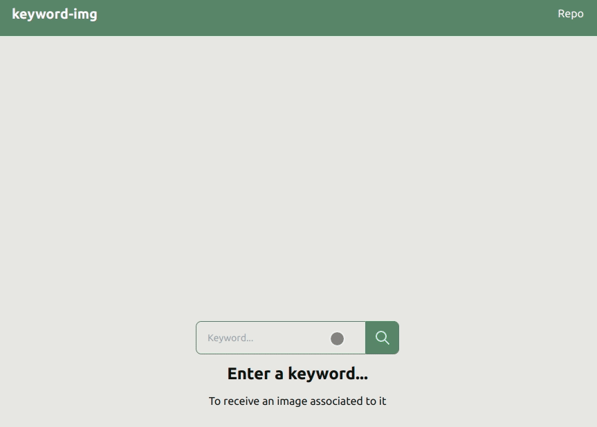
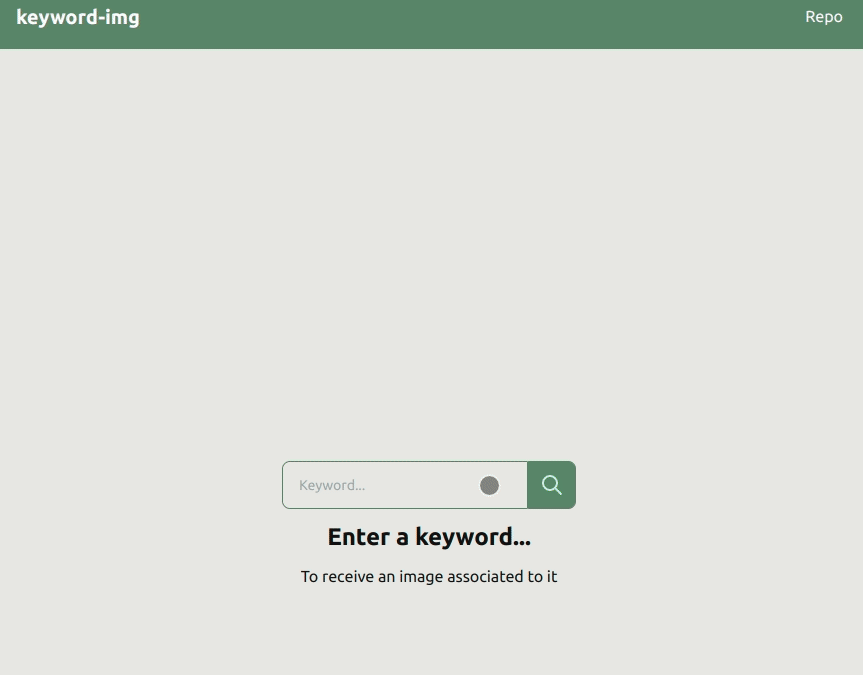

# [keyword-img](https://devmegan.github.io/keyword-img/)

A react app using that takes a keyword input and fetches a related image from [unsplash](https://unsplash.com/). Try it [here](https://devmegan.github.io/keyword-img/).

Has some basic error handling: 

Styled with [daisyUI](https://daisyui.com/) and [tailwindCSS](https://tailwindcss.com/).

Tested using [React Testing Library](https://testing-library.com/docs/react-testing-library/intro/). 

---

Clone me and then run me using `npm start`
Test me using `npm test` / `npm test --coverage`
Build me using `npm build`